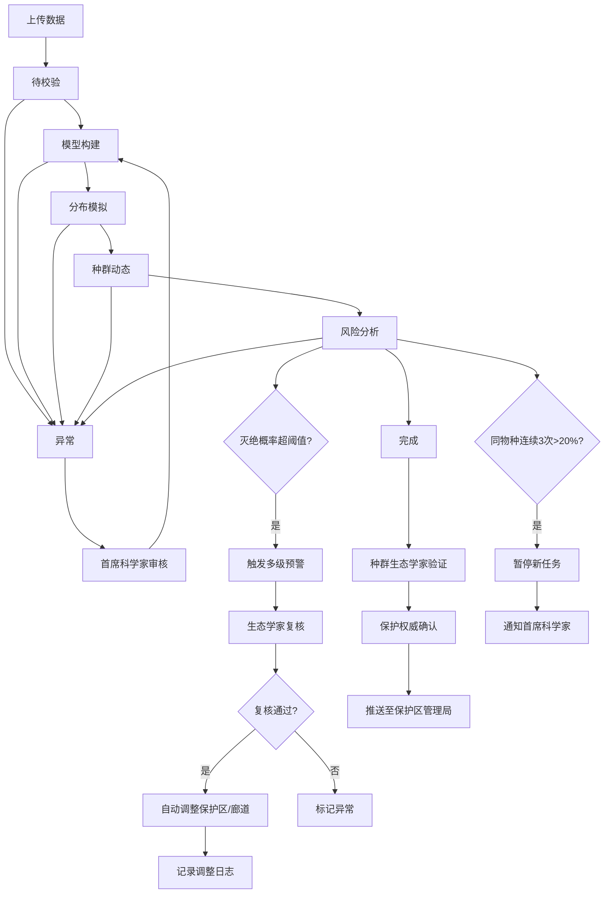

## 1. 产品概述

陆地生物多样性动态模拟与保护优先级规划平台，面向生态学家、保护权威机构和保护区管理局，提供从物种分布数据上传、模型构建、种群动态模拟到风险预警与保护策略优化的全流程数字化解决方案。

- 解决传统生物多样性评估耗时长、预警滞后、保护决策缺乏数据支撑的核心痛点
- 目标：将物种灭绝风险评估从月级缩短至小时级，实现保护策略的智能推荐与自动化审批

## 2. 核心功能

### 2.1 用户角色

| 角色 | 注册方式 | 核心权限 |
|------|----------|----------|
| 生态研究员 | 邮箱注册 | 上传数据、创建模拟任务、查看报告、导出数据 |
| 种群生态学家 | 邮箱注册+资质认证 | 模拟结果验证、预警复核、保护策略审核 |
| 保护权威 | 邀请制注册 | 审批确认保护策略、调整保护区边界 |
| 首席科学家 | 系统指定 | 处理暂停任务、审批异常恢复、全局监控 |
| 保护区管理局 | 邮箱注册 | 接收推送、查看调整日志、执行保护措施 |
| 系统管理员 | 系统指定 | 用户管理、系统配置、性能看板 |

### 2.2 功能模块

1. **数据管理中心**: 物种分布数据上传、环境变量管理、数据校验与清洗
2. **模拟任务中心**: 任务创建、状态流转管理、实时监控面板
3. **模型构建引擎**: 物种分布模型(SDM)、种群动态模型构建与参数配置
4. **风险预警系统**: 灭绝概率监控、种群增长率追踪、多级预警触发与推送
5. **保护策略规划**: 保护区边界调整、廊道布局优化、调整日志记录
6. **智能推荐引擎**: 历史模拟分析、最优保护策略推荐
7. **审批工作流**: 两级审批流程、审批记录追溯
8. **报告与数据导出**: 综合报告PDF生成、多维度数据导出
9. **性能看板**: 每日统计、完成率、预警响应时间、优化次数

### 2.3 页面详情

| 页面名称 | 模块名称 | 功能描述 |
|----------|----------|----------|
| 首页仪表盘 | 概览面板 | 今日模拟统计、活跃任务数、预警数、系统健康度指标卡片 |
| 首页仪表盘 | 实时动态 | 最近模拟完成、预警触发、审批通过等实时事件流 |
| 首页仪表盘 | 性能看板 | 每日完成率折线图、预警响应时间柱状图、优化次数趋势 |
| 数据管理 | 数据上传 | 拖拽上传物种分布CSV/Excel，环境变量GeoTIFF/NetCDF |
| 数据管理 | 数据校验 | 上传后自动校验字段完整性、坐标有效性、格式合规性 |
| 数据管理 | 数据列表 | 已上传数据集浏览、搜索、预览、删除 |
| 模拟任务 | 任务创建 | 选择物种与数据集、配置模型参数、设置预警阈值 |
| 模拟任务 | 任务列表 | 全部任务列表，支持按状态/物种/时间筛选 |
| 模拟任务 | 任务详情 | 任务状态流转时间线、实时灭绝概率与种群增长率监控 |
| 模拟任务 | 状态看板 | 看板视图展示待校验/模型构建/分布模拟/种群动态/风险分析/完成/异常各阶段任务数 |
| 风险监控 | 预警中心 | 活跃预警列表、预警级别标识、复核操作入口 |
| 风险监控 | 物种风险面板 | 单物种灭绝概率趋势、连续超阈值计数、暂停状态标识 |
| 风险监控 | 阈值配置 | 灭绝概率阈值、种群增长率阈值、连续触发次数设置 |
| 保护策略 | 策略推荐 | 智能推荐引擎输出的最优保护策略列表及置信度 |
| 保护策略 | 保护区调整 | 可视化保护区边界与廊道布局、调整操作与日志 |
| 保护策略 | 调整日志 | 所有保护区边界/廊道调整的历史记录 |
| 审批中心 | 待审批列表 | 待我审批的模拟结果、策略确认列表 |
| 审批中心 | 审批详情 | 模拟报告查看、审批/驳回操作、意见填写 |
| 报告中心 | 报告列表 | 已生成报告浏览、PDF下载 |
| 报告中心 | 报告详情 | 分布图、种群趋势曲线、风险热力图在线预览 |
| 报告中心 | 数据导出 | 按物种/生境/时间维度导出CSV/Excel数据 |

## 3. 核心流程

### 3.1 模拟任务全流程

用户上传物种分布数据和环境变量 → 系统自动校验数据完整性 → 任务进入"待校验"状态 → 校验通过进入"模型构建"阶段，系统构建SDM和种群动态模型 → 模型构建完成进入"分布模拟"阶段，生成物种分布预测 → 分布模拟完成进入"种群动态"阶段，模拟种群数量变化 → 种群动态完成进入"风险分析"阶段，计算灭绝概率和种群增长率 → 风险分析完成进入"完成"状态，生成综合报告。任何阶段异常则进入"异常"状态。

### 3.2 预警与复核流程

计算中实时监控灭绝概率和种群增长率 → 超过预设阈值自动触发多级预警 → 一级预警推送至生态研究员确认 → 二级预警推送至种群生态学家复核 → 三级预警推送至首席科学家 → 复核通过后自动调整保护区边界或廊道布局并记录调整日志。

### 3.3 两级审批流程

模拟完成后 → 种群生态学家验证模拟结果 → 验证通过提交至保护权威确认 → 保护权威确认通过 → 推送至保护区管理局执行。

### 3.4 连续超阈值暂停机制

同一物种连续三次灭绝概率超过20% → 系统自动暂停该物种所有新任务 → 通知首席科学家 → 首席科学家审核决定是否恢复。

## 4. 用户界面设计

### 4.1 设计风格

- **主色调**: 深森林绿(#1B4332)搭配琥珀金(#D4A017)作为强调色，传达生态保护与科学严谨的调性
- **辅助色**: 苔藓绿(#2D6A4F)、砂岩棕(#8B6914)、预警红(#C1292E)、安全蓝(#1E6091)
- **背景**: 深色主题(#0D1B16)搭配微弱地形纹理，营造科学实验室氛围
- **按钮风格**: 圆角矩形(8px)，主操作用琥珀金填充，次要操作用边框描边，预警操作用红色填充
- **字体**: 标题使用 Playfair Display，正文使用 Noto Sans SC，数据使用 JetBrains Mono
- **布局风格**: 左侧固定导航栏 + 顶部信息栏 + 主内容区域卡片式布局
- **图标风格**: 线性图标(Lucide风格)搭配自然元素点缀(叶片、山脉轮廓)

### 4.2 页面设计概览

| 页面名称 | 模块名称 | UI元素 |
|----------|----------|--------|
| 首页仪表盘 | 概览面板 | 4个统计卡片(渐变背景+图标)，圆角12px，悬浮微动画 |
| 首页仪表盘 | 实时动态 | 左侧事件流列表(带时间戳和状态标签)，右侧性能趋势图(Chart.js) |
| 数据管理 | 数据上传 | 虚线拖拽区域(悬浮时变绿色边框)，上传进度条，字段映射表格 |
| 模拟任务 | 任务详情 | 顶部状态时间线(7节点水平进度条)，中部双面板(左:灭绝概率仪表盘/右:种群增长率折线) |
| 模拟任务 | 状态看板 | 7列看板(Kanban)，每列显示该状态任务卡片，支持拖拽状态变更 |
| 风险监控 | 预警中心 | 预警卡片列表(红/橙/黄三级边框)，每卡片含物种名、阈值、当前值、时间 |
| 保护策略 | 保护区调整 | 中央交互式地图(Leaflet)，叠加保护区多边形和廊道线段，右侧调整面板 |
| 报告中心 | 报告详情 | 三标签页(分布图/种群趋势/风险热力图)，底部PDF下载按钮 |

### 4.3 响应式设计

- 桌面优先设计，最小宽度1280px
- 平板适配(768-1280px)：导航栏折叠为图标模式，卡片从4列变2列
- 移动端(768px以下)：底部Tab导航，卡片单列堆叠，地图全屏模式

### 4.4 3D场景指引

- 不涉及3D场景，采用2D地图可视化(Leaflet)和图表可视化(Chart.js)为主
