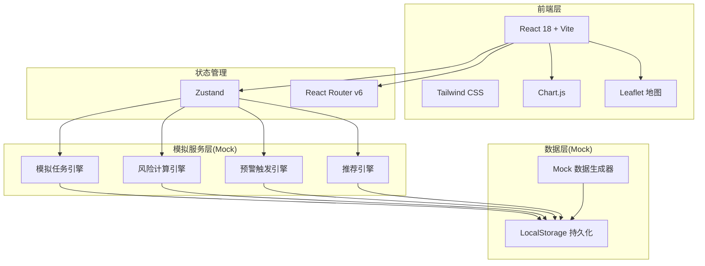
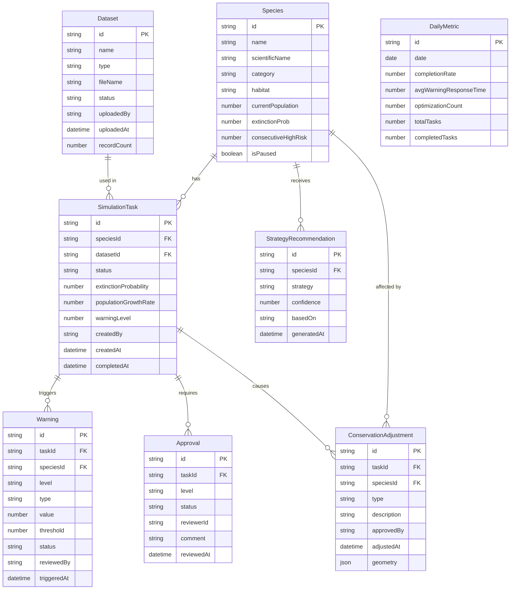

## 1. 架构设计



## 2. 技术说明

- **前端**: React@18 + TailwindCSS@3 + Vite
- **初始化工具**: Vite (npm create vite@latest)
- **后端**: 无后端，全部使用前端Mock数据模拟
- **数据库**: LocalStorage + 内存状态管理(Zustand)
- **地图**: Leaflet + React-Leaflet
- **图表**: Chart.js + react-chartjs-2
- **PDF生成**: jsPDF + html2canvas
- **图标**: Lucide React
- **动画**: Framer Motion
- **状态管理**: Zustand
- **路由**: React Router v6

## 3. 路由定义

| 路由 | 用途 |
|------|------|
| / | 首页仪表盘 |
| /data | 数据管理中心 |
| /data/upload | 数据上传 |
| /tasks | 模拟任务列表 |
| /tasks/kanban | 任务状态看板 |
| /tasks/:id | 任务详情 |
| /tasks/create | 创建模拟任务 |
| /risk | 风险监控中心 |
| /risk/threshold | 阈值配置 |
| /conservation | 保护策略规划 |
| /conservation/log | 调整日志 |
| /approval | 审批中心 |
| /approval/:id | 审批详情 |
| /reports | 报告列表 |
| /reports/:id | 报告详情 |
| /reports/export | 数据导出 |

## 4. 数据模型

### 4.1 数据模型定义



### 4.2 模拟任务状态枚举

```
PENDING_REVIEW(待校验) → MODEL_BUILDING(模型构建) → DISTRIBUTION_SIM(分布模拟) → POPULATION_DYNAMICS(种群动态) → RISK_ANALYSIS(风险分析) → COMPLETED(完成)
任何阶段 → ERROR(异常)
ERROR → PENDING_REVIEW(首席科学家审核后重新开始)
```

### 4.3 预警级别枚举

```
LEVEL_1(一级-黄色): 灭绝概率10%-15% 或 种群增长率<-5%
LEVEL_2(二级-橙色): 灭绝概率15%-20% 或 种群增长率<-10%
LEVEL_3(三级-红色): 灭绝概率>20% 或 种群增长率<-15%
```
